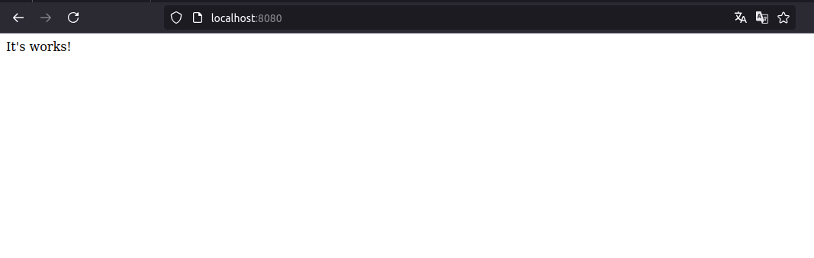

# Docker do Desenvolvimento a Produção

Clone o repositório:
```bash
git clone https://github.com/Mateus-Sebastiao/docker-lab.git
cd docker-lab/custom-nginx/
```

Construa a imagem:
```bash
docker image build -t custom-nginx .
```

Rode um container:
```bash
docker container run -d -p 8080:80 --name app custom-nginx
```

Teste no navegador com `http://localhost:8080` ou CLI: 
```bash
curl -IL http://localhost:8080/
```

## Trabalhando com volumes
```bash
docker container run -d -p 8080:80 -v $(pwd):/var/www/html --name app custom-nginx
```

Nota: $(pwd) = ~/docker-lab/custom-nginx/nginx/

<div align="center">
    
</div>