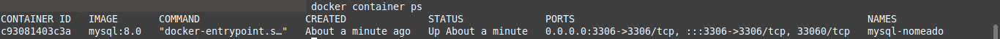
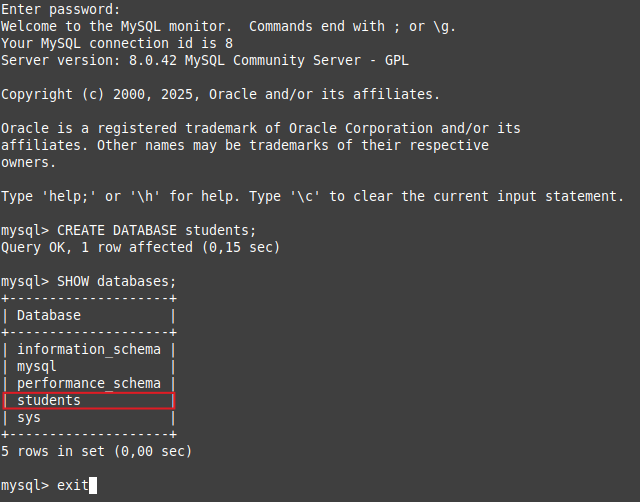
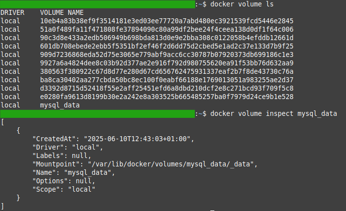
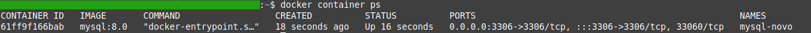
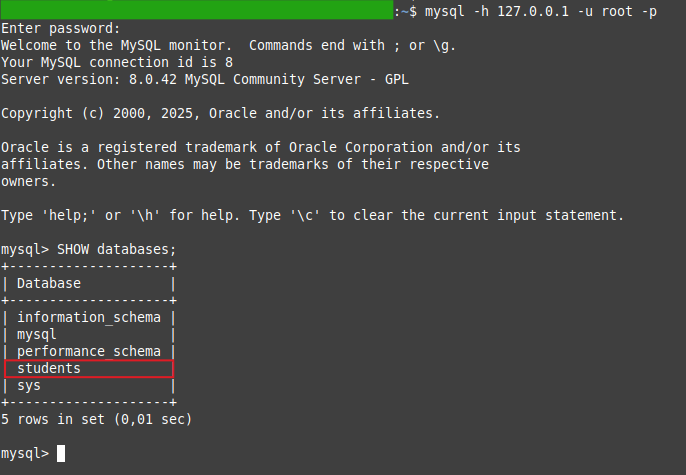

# Volume Nomeado

Nesse diretório o meu foco é entender como os dados persistem mesmo quando o container é removido.

## 1. Rodar container MySQL com volume nomeado
```bash
docker container run -d \
  --name mysql-nomeado \
  -e MYSQL_ROOT_PASSWORD=senha123 \
  -v mysql_data:/var/lib/mysql \
  -p 3306:3306 \
  mysql:8.0
```

## 2. Verificar se o container está em execução (opcional)
```bash
docker container ps
```

<div align="center">
    
</div>

## 3. Criar um banco de dados e verificar os bancos
```bash
mysql -h 127.0.0.1 -u root -p
```

**Nota**: Depois insira a senha do root definida ao rodar o container.

```bash
CREATE DATABASE students;
SHOW databases;
```

<div align="center">
    
</div>

## 4. Testar persistência
```bash
docker stop mysql-nomeado
docker rm mysql-nomeado
```

## 5. Explorar com `docker volume` e o `docker inspect`
```bash
docker volume ls
docker volume inspect mysql_data
```

<div align="center">
    
</div>

# 6. Rodar novo container com o mesmo volume
```bash
docker run -d \
  --name mysql-novo \
  -e MYSQL_ROOT_PASSWORD=senha123 \
  -v mysql_data:/var/lib/mysql \
  -p 3306:3306 \
  mysql:8.0
```

<div align="center">
    
</div>

<div align="center">
    
</div>