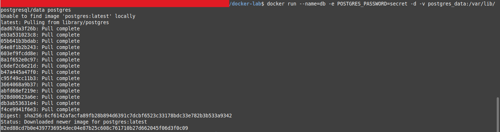
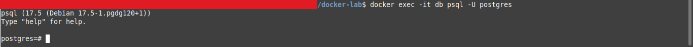
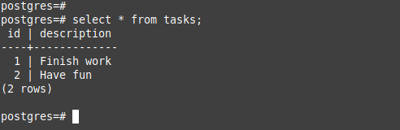
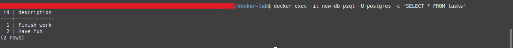

# Praticando Persistência dos Dados dos Containers 

Inicie um container usando a [imagem do Postgres](https://hub.docker.com/_/postgres?_gl=1*9tglgm*_gcl_au*MTQ1MDg5MTQzNy4xNzQ5MTI2NDM0*_ga*Njk0OTE5NDE4LjE3NDkxMjY0MzY.*_ga_XJWPQMJYHQ*czE3NDk3Mzk0ODYkbzIwJGcxJHQxNzQ5NzQxMjIyJGo2MCRsMCRoMA..) com o seguinte comando:

```bash
docker run --name=db -e POSTGRES_PASSWORD=secret -d -v postgres_data:/var/lib/postgresql/data postgres
```

<div align="center">
    
</div>

Conecte-se ao banco de dados usando o seguinte comando:

```bash
docker exec -it db psql -U postgres
```

<div align="center">
    
</div>

Na linha de comando do PostgreSQL, execute o seguinte para criar uma tabela de banco de dados e inserir dois registros:

```bash
CREATE TABLE tasks ( id SERIAL PRIMARY KEY, description VARCHAR(100) );
INSERT INTO tasks (description) VALUES ('Finish work'), ('Have fun');
```

Verifique se os dados estão no banco de dados executando o seguinte na linha de comando do PostgreSQL: 

```bash
SELECT * FROM tasks;
```

Saída:

<div align="center">
    
</div>

Saia do shell do PostgreSQL executando o seguinte comando:

```bash
\q
```

Pare e remova o container do banco de dados. Lembre-se de que, mesmo que o container tenha sido excluído, os dados são mantidos no volume `postgres_data`. 

```bash
docker stop db
docker rm db
```

Inicie um novo container executando o seguinte comando, anexando o mesmo volume com os dados persistentes:

```bash
docker run --name=new-db -d -v postgres_data:/var/lib/postgresql/data postgres
```

Você deve ter notado que a variável de ambiente `POSTGRES_PASSWORD` foi omitida. Isso ocorre porque essa variável só é usada ao inicializar um novo banco de dados.

Verifique se o banco de dados ainda possui os registros executando o seguinte comando: 

```bash
docker exec -it new-db psql -U postgres -c "SELECT * FROM tasks"
```

<div align="center">
    
</div>
